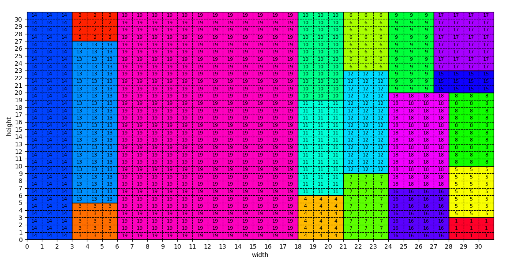

# :gear: Very Large Scale Integration :bar_chart:

This repository contains a project realized as part of the *Combinatorial Decision Making and Optimization course* exam of the [Master's degree in Artificial Intelligence, University of Bologna](https://corsi.unibo.it/2cycle/artificial-intelligence).

*VLSI* (Very Large Scale Integration) refers to the trend of integrating circuits into silicon chips.
The problem is to design the VLSI of the circuits defining your electrical device: given a
fixed-width plate and a list of rectangular circuits, decide how to place them
on the plate so that the length of the final device is minimized (improving its
portability).
Different solution in CP, SAT and SMT have been developed.

## Repository structure

    .
    ├── assets 
    │   ├── results                    # Plots of the numerical results
    │   └── img                        # Images used in the report
    ├── data
    │   └── instances_txt              # Input instances in txt format 
    ├── CP                             # Folder containing all CP files
    │   ├── benchmarks                 # Folder containing excel sheets to compare results of different search parameters 
    │   ├── instances_dzn              # Input instances for CP in dzn format 
    │   ├── out                        # Outputs of the execution of instances with CP
    │   ├── src
    │   │   ├── model_final.mzn        # The model which produces the best resuls in CP 
    │   │   ├── model_rotation.mzn     # The model which allows also to rotate circuits
    │   │   ├── model_symmetries.mzn   # The model which implements symmetries breaking constraints
    │   │   ├── solve_cp_instances.py  # Script to solve all instrances in CP 
    │   │   └── solve_instance.py      # Script to solve a single instrance in CP 
    │   └── CP_report.pdf              # Report about the CP solution
    ├── SAT                            # Folder containing all SAT files
    │   ├── out                        # Outputs of the execution of instances with SAT
    │   ├── src
    │   │   ├── model_final.mzn        # The model which produces the best resuls in SAT 
    │   │   ├── model_rotation.mzn     # The model which allows also to rotate circuits
    │   │   ├── model_symmetries.mzn   # The model which implements symmetries breaking constraints
    │   │   ├── model_bimander.mzn     # The model which implements the alternative at-most-one encoding
    │   │   ├── solve_sat_instances.py # Script to solve all instrances in SAT 
    │   │   └── sat_utils.py           # Utility functions for SAT
    │   └── SAT_report.pdf             # Report about the SAT solution
    ├── SMT                            # Folder containing all SMT files
    │   ├── out                        # Outputs of the execution of instances with SMT
    │   ├── src
    │   │   ├── model_final.mzn        # The model which produces the best resuls in SMT 
    │   │   ├── model_rotation.mzn     # The model which allows also to rotate circuits
    │   │   └── solve_smt_instances.py # Script to solve all instrances in SMT
    │   └── SMT_report.pdf             # Report about the SMT solution
    ├── utils                          
    │   ├── instances_to_dzn.py        # Script to convert input instances from txt to dzn                      
    │   ├── plot_solution.py           # Script to visualize a specific output
    │   └── show_results.py            # Script to plot the times to get results for all instances 
    ├── assigment.pdf
    ├── LICENSE
    └── README.md

## Prerequisites
It is required to install [Minizinc](https://www.minizinc.org/) and add the executable to the environment variable PATH.
In order to execute SAT and SMT solution the Z3 theorem prover for python is required.

The easiest way to install Z3Py, along with the Z3 binary, is to use Python's package manager pip:
```
pip install z3-solver
```

## Utils Execution Instruction:
### Show an image of a solution:

In order to visualize solutions, you can use the script `plot_solution.py`.
It is required to pass as parameter the output file, eg:
```
python plot_solution.py -f <solution file path>
```

An example of output is as follows:


### Plot barchart of execution time of instances

In order to create a barchart of the times of execution of different instances, you can use the script `show_results.py`.
Enter on utils
Open file <b>show_results.py</b>
In <b>main()</b> [line 106] modify:
```
column_names = <list of models names> (e.g. ['rotation','final','symmetries'])
directories = <list of output folder for the models> (e.g. ["../SAT/out/rotation","../SAT/out/final","../SAT/out/symmetries"])
num = <maximum of instances that can be plotted>
title = <title of image>
```
Then run the file 
```
python show_results.py
```

### Production of dzn instances from txt for CP models

In order to convert .txt instances into .dzn instances, run

```console
python instances_to_dzn.py
```

## Versioning

We use Git for versioning.


## Group members

| Reg No. |   Name    |  Surname  |                 Email                  |                       Username                        |
| :-----: | :-------: | :-------: | :------------------------------------: | :---------------------------------------------------: |
| 997317  | Giuseppe  |   Murro   |    `giuseppe.murro@studio.unibo.it`    |         [_gmurro_](https://github.com/gmurro)         |
| 985203  | Salvatore | Pisciotta | `salvatore.pisciotta2@studio.unibo.it` | [_SalvoPisciotta_](https://github.com/SalvoPisciotta) |


## License

This project is licensed under the MIT License - see the [LICENSE](LICENSE) file for details
